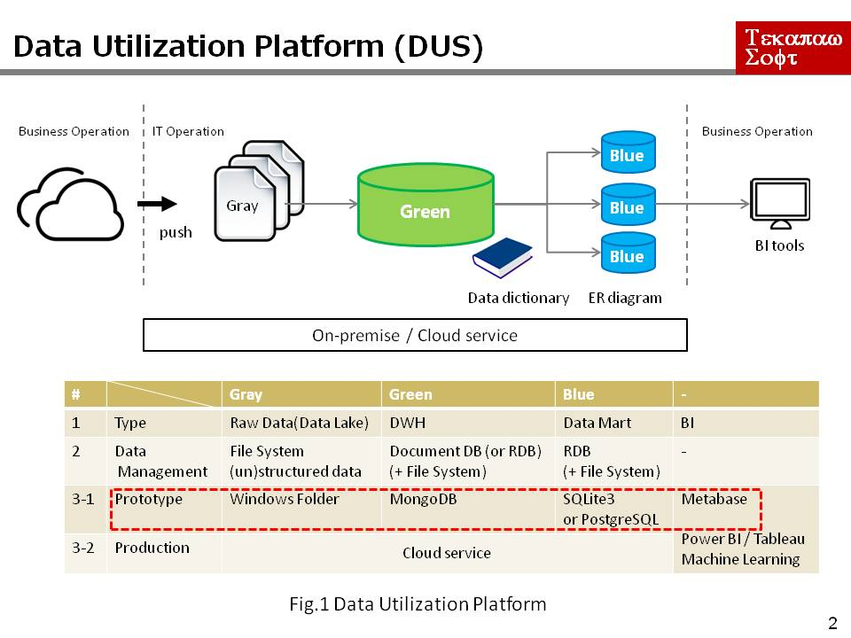
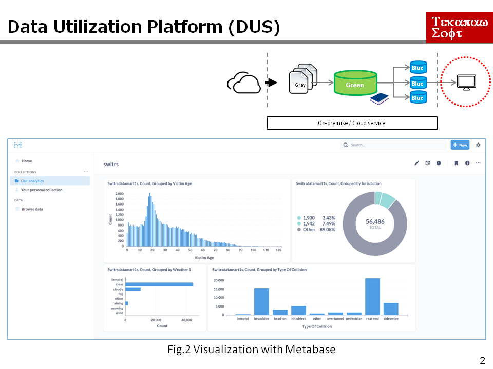
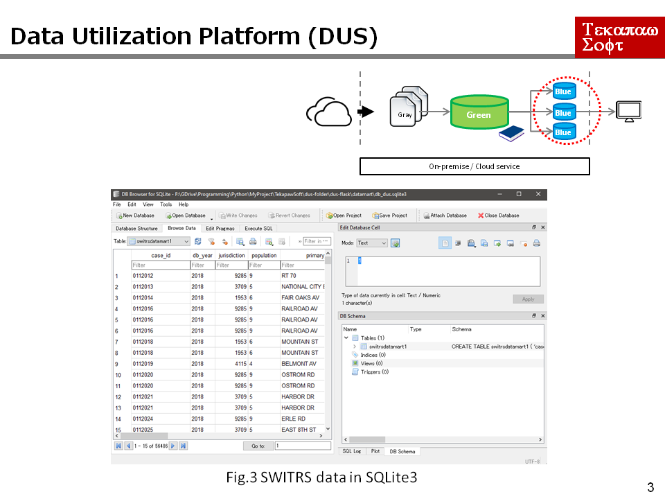
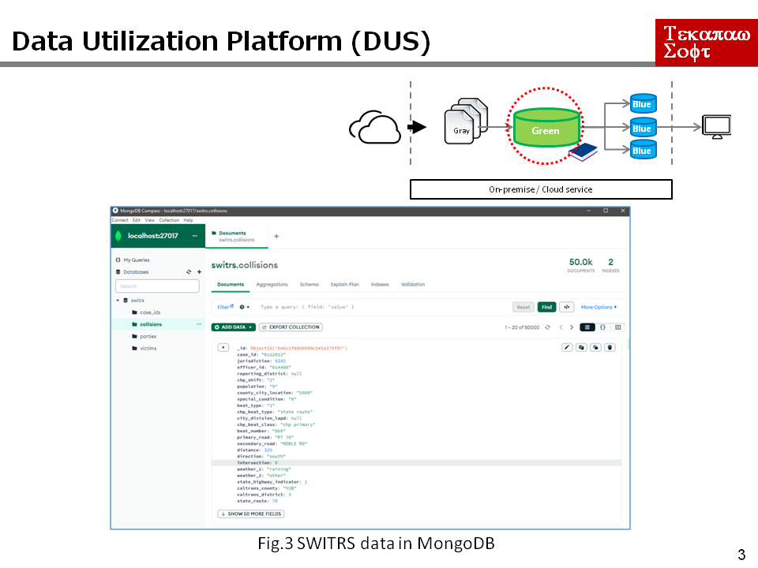

# Data Utilization Platform

# [[[ Under Construction ]]]
# 1. What you can do

* To gather and accumulate business data. 
* To utilize these data with some commercial BI tools.

 

# 2. System Configuration

 

 

 

 

# 3. Sample data

Kaggle: California Traffic Collision Data from SWITRS

https://www.kaggle.com/datasets/alexgude/california-traffic-collision-data-from-switrs

